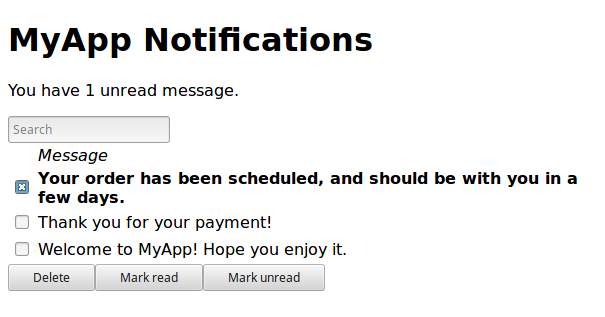

==========
 Tutorial
==========

.. contents:: Tutorial contents
   :local:

Intro
=====

This tutorial will start from the assumption that you already have an app which
hard codes a single language. This is the ‘source language’, and we'll assume
it's English for simplicity. You will be introduced to most of the key features
of the Fluent language (although it is recommended that you also read `the
Fluent guide <https://projectfluent.org/fluent/guide/>`_ fully), and some key
principles of internationalization.

If you are already using another i18n/translation solution, hopefully it should
be obvious how to adapt this tutorial for your situation.

Our example will be a 'notifications' page in a web app. The full sources of
this demo app are available, and it may be useful to have them open as you read
the tutorial:

* `Notifications app without Fluent <https://github.com/elm-fluent/elm-fluent/tree/master/docs/tutorial_code/pre>`_
* `Notifications app with Fluent <https://github.com/elm-fluent/elm-fluent/tree/master/docs/tutorial_code/post>`_

It consists of a title, a search bar, a list of notifications and some buttons
for deleting or 'mark as read' — here it is in all its unstyled glory:

It is assumed you have followed the :doc:`installation` documentation for
setting up your project with elm-fluent.

One-time project changes
========================

As you start to internationalize your app, there are some one time changes
you'll need, usually across your whole app. For this demo, our whole app is one
page, to keep it simple, but for your app your would need to put the initial
plumbing in the right place so that it applies across everything.

Our first step is to keep track of the user's choice of locale. This could come
from a server side setting that is passed into your app via flags, or it could
be handled entirely from Elm code. For our demo, we will default to English and
have a simple select box for changing the language, and we won't be saving the
preference anywhere (but you would need to do that for a real app).

First we need an import:

.. code-block:: elm

   import Intl.Locale as Locale

Then we need to add a field to our model:

.. code-block:: elm

   type alias Model = {
       { locale : Locale.Locale
       -- (etc.)
       }

and add a default value:

.. code-block:: elm

   defaultLocale : Locale.Locale
   defaultLocale =
       Locale.en

   init : Flags -> ( Model, Cmd Msg )
   init flags =
       ( { locale = defaultLocale
         -- (etc.)
         }
       , Cmd.none
       )

We'll want a list of locales/languages we support, with some kind of caption:

.. code-block:: elm

   availableLanguageChoices : List ( String, String )
   availableLanguageChoices =
       [ ( "en", "English" )
       , ( "tr", "Turkçe" )
       ]

Here we've used the localized name of the language as the caption. To make it
easier for people to find their own language, and get back if they accidentally
change the language to Chinese etc., we won't translate these depending on the
user's choice of language. So this is one of the few times that we'll hard code
localized text into our Elm file (although there are other ways to do this).

For each language tag (the first value in the tuples above), we want a
``Locale`` object as well:

.. code-block:: elm

   availableLocales : List ( Locale.Locale, String )
   availableLocales =
       List.map
           (\( languageTag, caption ) ->
               ( Locale.fromLanguageTag
                   languageTag
                   |> Maybe.withDefault defaultLocale
               , caption
               )
           )
           availableLanguageChoices

.. note::

   The ``Locale.fromLanguageTag`` function can fail, in which case it returns
   ``Nothing``, hence the use of ``withDefault`` above. The function actually
   only fails if you pass invalid language tags — it does not fail if you pass a
   `valid BCP47 language tag
   <https://www.w3.org/International/articles/language-tags/>`_ that the browser
   doesn't happen to support. We only passed valid language tags, but the
   compiler doesn't know that, so we still need the fallback here although it
   won't be used in practice.

We'll need a message to change locale:

.. code-block:: elm

   type Msg
       = ChangeLocale Locale.Locale
       -- (etc.)

And we need to handle that message:

.. code-block:: elm

   update : Msg -> Model -> ( Model, Cmd Msg )
   update msg model =
       let
           newModel =
               case msg of
                   ChangeLocale locale ->
                       { model
                           | locale = locale
                       }
           -- etc.

We need some UI to select a different locale (you can skip this step for now if
you just want to try the system out using the default English locale). The
following is a simple ``select`` widget that will trigger ``ChangeLocale`` when
it is changed:

.. code-block:: elm

   viewLocaleSwitcher : Model -> List (H.Html Msg)
   viewLocaleSwitcher model =
       [ H.text "Change language: "
       , H.select []
           (List.map
               (\( locale, caption ) ->
                   H.option [ E.onClick (ChangeLocale locale) ]
                       [ H.text caption ]
               )
               availableLocales
           )
       ]

And we need to include this somewhere in the page by adding it to the main
``view`` function (left as an exercise for you!).

Also left as an exercise for you - if you change a page locale/language, you
should always remember to `set the lang attribute
<https://www.w3.org/International/questions/qa-html-language-declarations>`_ on
the root ``<html>`` element, and you may want to update the document ``<title>``
as well. You'll probably need to do both of these using a port (because
typically these elements are outside of the root element that Elm controls).

Extract localized text
======================

Now that the basic setup of the project has been done, we can begin extracting
localized text (i.e. all the English text that needs to be translated) into
``.ftl`` files.

You need to create a ``locales`` directory to store these files. This can go
anywhere, as the ``ftl2elm`` program allows you to specify the location using
``--locales-dir``. We will use the default, which is to place it in the same
directory as your top level Elm source files.

Within it, create an ``en`` directory to store the English ``.ftl`` files.
Within that you can create any number of sub folders, as your project structure
dictates. We will create a file ``notifications.ftl`` directly within ``en``
that will contain the messages for our Notifications module.

.. note::

   You have flexibility in how you structure your FTL files and the folders that
   contain them. A good pattern is to structure these files and folders in a way
   that mirrors the rest of your project structure.

Now we will create our first FTL message. Our view function currently looks like:

.. code-block:: elm

   view : Model -> H.Html Msg
   view model =
       H.div []
           [ H.h1 [] [ H.text "MyApp Notifications" ]
           -- etc
           ]

``"MyApp Notifications"`` needs to be localized, so we'll pull it out into
``notifications.ftl``. This is one of the simplest possible messages — an
entirely static string with no substitutions, which will look like this in our
``notifications.ftl`` file:

.. code-block:: ftl

   # This title appears at the top of the notifications page
   notifications-title = MyApp Notifications

Notice:

1. The comment which begins with ``#`` — comments can be really important in
   creating ``.ftl`` files that are understandable and well organized. The
   Fluent guide has `more information
   <https://projectfluent.org/fluent/guide/comments.html>`_.

   For brevity this tutorial will omit comments for the rest of the messages we
   add.

2. The ``notification-`` prefix.

   This is used as an adhoc prefix to indicate the component/page this message
   belongs to. This is not strictly necessary with elm-fluent, but has several
   advantages:

   * If you want to combine FTL files at some point, it will help to avoid name
     clashes. You may also want to use the same FTL files with other
     technologies (e.g. server side rendering), and these technologies tend
     to use bundles that combine multiple ``.ftl`` files.

   * It will result in an Elm function that has a longer name, and so helps
     reduce the possibility of name clashes with other functions. To avoid
     problems, elm-fluent refuses to generate functions that would clash with
     `default imports
     <https://package.elm-lang.org/packages/elm/core/latest/Basics>`_.

   * It is the convention used by Mozilla for their message IDs, and so
     is a standard.

3. The naming style:

   The naming style used here is words-separated-with-hyphens. This is the
   normal convention in Fluent. These are not valid identifiers in Elm, and so
   are converted to camelCase by ``ftl2elm``. You could also use camelCase
   directly as your message ID e.g. ``notificationsTitle``

Now run the ``ftl2elm``::

  ftl2elm --verbose

(See also ``ftl2elm --help`` for other options, especially if you are using a
different directory layout.)

You'll hopefully see output like the following::

    Writing files:

    Writing Ftl/EN/Notifications.elm
    Writing Ftl/Translations/Notifications.elm
    Success!

(This tutorial won't mention running ``ftl2elm`` again - every time you change
``.ftl`` files you'll need to run ``ftl2elm`` again - or, use the ``--watch``
option and leave it running).

Let's look at ``Ftl/EN/Notifications.elm``. This is a compilation of our
``notifications.ftl``, and it looks something like this (slightly abridged):

.. code-block:: elm

   module Ftl.EN.Notifications exposing (notificationsTitle)

   import Intl.Locale as Locale

   notificationsTitle : Locale.Locale -> a -> String
   notificationsTitle locale_ args_ =
       "MyApp Notifications"

The body is as simple as you would expect for this simple case — it just returns
the string!

In addition, there is a similar function in ``Ftl/Translations.elm``. The sole
purpose of this function is to dispatch to the correct language, depending on
the locale you pass in. It looks something like this (a bit redundant at the
moment, as we only have one language so far):

.. code-block:: elm

    module Ftl.Translations.Notifications exposing (notificationsTitle)

    import Ftl.EN.Notifications as EN
    import Intl.Locale as Locale

    notificationsTitle : Locale.Locale -> a -> String
    notificationsTitle locale_ args_ =
        case String.toLower (Locale.toLanguageTag locale_) of
            "en" ->
                EN.notificationsTitle locale_ args_
            _ ->
                EN.notificationsTitle locale_ args_

This is the function we'll be using from our ``Notifications.elm`` module. First
some imports are needed:

.. code-block:: elm

   import Fluent
   import Ftl.Translations.Notifications as T

Then we modify the view function to use the generated function:

.. code-block:: elm

   view : Model -> H.Html Msg
   view model =
       H.div []
           [ H.h1 [] [ H.text (T.notificationsTitle model.locale ()) ]
           -- etc.
           ]

Note we always pass:

* the locale value
* a value containing substitution parameters (if any).

In this case we have no substitution parameters, so we can pass any value, and
we chose the empty value ``()`` for simplicity.

First message done! You can check your project compiles and works.

.. note::

   **Generated Ftl files**

   A bunch of files have been generated in a ``Ftl`` folder. You shouldn't edit
   these directly, or add them to VCS. Be sure to add this folder to
   ``.gitignore`` (etc.)

Substitutions
=============

The next bit of our view consists of `some Elm code
<https://github.com/elm-fluent/elm-fluent/blob/master/docs/tutorial_code/pre/Notifications.elm#L118>`_
that generates text like the following:

    Hello, Mary. You have 2 unread messages.

We can split this into two messages.

.. note::

   Splitting of localized text has to be done very carefully. One of the key
   principles of translating apps is that **you cannot split a sentence or label
   into parts and translate the parts separately**. This might work for English,
   but will fail for other languages. Usually if you have several unrelated
   sentences in a block of text, you can split them into a message for each
   sentence, but do not split up a sentence (or other text fragment like a
   title) further.

Our first message is a greeting, but it has a substitution. It will look like this in our FTL file:

.. code-block:: ftl

   notifications-greeting = Hello, { $username }.

And we use it like this in our Elm code:

.. code-block:: elm

     [ H.text (T.notificationsGreeting model.locale { username = model.userName })
     -- (etc.)
     ]

Notice how we pass substitutions in a record type. The signature for
``notificationsGreeting`` looks like this:

.. code-block:: elm

   notificationsGreeting : Locale.Locale -> { a | username : String } -> String

This means if you fail to pass this argument in your Elm code, or try to pass
something of the wrong type, you'll get a compilation error, which is exactly
what we want to happen.

Number substitutions and plural rules
=====================================

The next sentence we need to internationalize is ``"You have X unread
messages."``.

The Elm code we are starting with looks like this:

.. code-block:: elm

   H.text
     (let
         unreadNotificationsCount =
             unreadNotifications model |> List.length
      in
         if unreadNotificationsCount == 1 then
             "You have 1 unread message."
         else
             ("You have " ++ toString unreadNotificationsCount ++ " unread messages.")
     )

There are some big issues with this code:

* It hard-codes English language pluralization rules. In English, we use the
  singular form for 1, and plural form for everything else (including zero).
  This pattern does not apply to other languages. So we need to move this logic
  into the FTL file, where translators are able to apply the correct logic for
  their language.

* It hard-codes a number formatting function that is only appropriate for some
  languages. If we were using floating point numbers, we can easily get
  completely wrong number formatting. For example, ``1.002`` ("one and two
  one-thousandths") can be written in English as the string ``"1.002"``.
  However, in most European locales, that string means "one thousand and two",
  while ``"1,002"`` means "one and two one-thousandths".

Fluent fixes these things for us. We pull out the entire message into FTL like
this, using `Fluent selector syntax
<https://projectfluent.org/fluent/guide/selectors.html>`_, to produce the
following which is appropriate for English:

.. code-block:: ftl

   notifications-unread-count = { $count ->
       [one]     You have 1 unread message.
      *[other]   You have { NUMBER($count) } unread messages.
    }

Our view code looks like this:

.. code-block:: elm

   H.text
     (T.notificationsUnreadCount model.locale
         { count = Fluent.number (unreadNotifications model |> List.length) }
     )

This time, instead of passing a string as an argument, we pass a number. We
actually pass it as a ``Fluent.FluentNumber number`` value. The purpose of
``FluentNumber`` is that it allows us to optionally pass formatting options
along with the number. In this case we didn't add formatting options, so we just
used :ref:`fluent-number`. We could have used :ref:`fluent-formattednumber` to
specify formatting options (which includes things like currencies).

It is also possible for the translators to add parameters using the `NUMBER
builtin <https://projectfluent.org/fluent/guide/functions.html#number>`_.

Similarly, not covered in this tutorial, there is the Fluent `DATETIME builtin
<https://projectfluent.org/fluent/guide/functions.html#datetime>`_, and
elm-fluent functions :ref:`fluent-date` and :ref:`fluent-formatteddate` which
are used to pass dates into messages.

Message attributes
==================

The next piece of HTML we need to internationalize is the search box. The Elm
code looks like this:

.. code-block:: elm

   viewSearchBar : Model -> H.Html Msg
   viewSearchBar model =
       H.div []
           [ H.input
               [ A.type_ "search"
               , A.name "q"
               , A.placeholder "Search"
               , A.attribute "aria-label" "Search through notifications"
               , A.value model.searchBoxText
               , E.onInput SearchBoxInput
               ]
               []
           ]

We can continue with this in exactly the same way as before — creating a message
for each piece of English text that needs to be translated. One need that often
crops up in web apps is that we have some closely related pieces of text, and we
might want to group them more tightly. In the case above we have two pieces of
text that appear as part of the search box - ``"Search"`` as the placeholder,
and ``"Search through notifications"`` as the `ARIA label
<https://www.w3.org/TR/wai-aria-1.1/#aria-label>`_, which will be used by screen
readers.

There is a Fluent feature designed exactly for this case, called attributes. We
can create an FTL message as follows:

.. code-block:: ftl

   notifications-search-box =
                           .placeholder = Search
                           .aria-label = Search through notifications

This will create two message functions for us. In this case, to produce valid
Elm identifiers, the ``.`` is translated to an underscore, so we end up with
``notificationsSearchBox_placeholder`` and ``notificationsSearchBox_ariaLabel``.
These can be used in the same way as before, so our Elm code becomes:

.. code-block:: elm

   viewSearchBar : Model -> H.Html Msg
   viewSearchBar model =
       H.div []
           [ H.input
               [ A.type_ "search"
               , A.name "q"
               , A.placeholder (T.notificationsSearchBox_placeholder model.locale ())
               , A.attribute "aria-label" (T.notificationsSearchBox_ariaLabel model.locale ())
               , A.value model.searchBoxText
               , E.onInput SearchBoxInput
               ]
               []
           ]

This example also illustrates the use of localized text in attributes — because
our translation functions simply return strings, their output can be used in a
wide variety of contexts.

HTML output
===========

Although string output is the most flexible, there are times when you need HTML
output.

For example, we may simply want to highlight some text in some way. Suppose in our
greeting we want to highlight the username in bold:

.. code-block:: html

   Hello <b>Mary</b>, so nice to have you back!

Remember that a key rule of i18n is that we mustn't attempt to split this into
parts, translate separately, and put back together. We need to keep these parts
together as a single, translatable unit.

This is handled in elm-fluent simply by giving the message ID a special suffix -
``-html`` or ``Html`` — and then putting the desired HTML markup directly in the
``.ftl`` file:

.. code-block:: ftl

   notifications-greeting-html = Hello <b>{ $username }</b>, so nice to have you back!

In this case, ``ftl2elm`` will generate a function which returns ``List (Html
msg)`` instead of ``String``. You can use it just as you expect, e.g.:

.. code-block:: elm

   H.p []
     (T.notificationsGreetingHtml model.locale { username = model.userName } [])

Note, however, this takes one extra parameter, for which we passed an empty
list. The purpose of this parameter is explained in the next section.

Before we go on, there are a few things to note:

* Compare the combined FTL + Elm you have above with what you would have had
  before if you had written it all in Elm:

  .. code-block:: elm

     H.p []
       [ H.text "Hello "
       , H.b [] [ H.text model.userName
                ]
       , H.text ", so nice to have you back!"
       ]

  You may notice that your code, even when you add back in the FTL, is now
  shorter and much more readable! This is just a little bonus that comes from
  using a purpose-designed language like FTL, and a compiler (ftl2elm) that will
  generate all that ``Html`` code for you...

* elm-fluent can handle a lot more than this simple case — all the other Fluent
  features can be combined with HTML. This includes also being able to use
  attributes in the HTML, and substitutions within attributes etc.

  There are a few limitations. You cannot have substitutions or other similar
  constructs in element names or attribute names, for example:

  .. code-block:: ftl

    bad-message-1-html = Some <{ $arg }>text</{ $arg }>

    bad-message-2-html = Some <b { $arg }="value">text</b>

  There are also limitations with respect to Fluent's mechanism for `message
  references <https://projectfluent.org/fluent/guide/references.html>`_. You can
  reference both HTML and plain text messages from HTML messages, and it will do
  the right thing, but you cannot reference an HTML message from a plain text
  one. (This might be obvious from the type system - we can embed ``String``
  into ``List (Html msg)`` via ``Html.text``, but we can't embed ``List (Html
  msg)`` into ``String``.

* You should consider carefully how much HTML you should put into your FTL
  files, and keep it as simple as possible. Remember it will be read and
  translated by translators who may not be experts in HTML. Use the mechanisms
  described in the next section to keep as many HTML attributes in your Elm code
  as possible.

Dynamic HTML output
===================

The above mechanism works fine for simple cases, but in Elm we often have more
complex HTML, and in particular we have ``Html`` constructs that cannot be
simply embedded into FTL files as a string.

For example, in our demo app, when you press the 'Delete' button, you get a
confirmation panel that has hyperlinks like this:

    These 2 messages will be permanently deleted - **cancel** or **confirm**

…except that 'cancel' and 'confirm' are hyperlinks with behavior attached. The
original Elm code looks like this:

  .. code-block:: elm

     [ H.text "These "
     , H.text <| toString <| Set.size model.selectedNotifications
     , H.text " messages will be permanently deleted - "
     , H.a
         [ A.href "#"
         , onClickSimply DeleteCancel
         ]
         [ H.text "cancel" ]
     , H.text " or "
     , H.a
         [ A.href "#"
         , onClickSimply DeleteConfirm
         ]
         [ H.text "confirm" ]
     ]

We need the ``a`` elements to be embedded in translatable text (as discussed
above — we don't want to split this text up). But we also need a way to attach
those event handlers to the anchors, and we need to ensure we don't mix up those
event handlers.

(Also, we got lazy above and didn't handle the case of a single message very
well — we'll fix that as we go).

This is probably one of the most complex examples you'll come across, so the
next section will be a little bit heavy. But if you can master this you have the
tools to handle any similar situation.

Let's start with a first attempt at our FTL message:

.. code-block:: ftl

   notifications-delete-confirm-panel-html =
     { $count ->
        [one]    This message
       *[other]  These { $count } messages
     } will be permanently deleted - <a>cancel</a> or <a>confirm</a>

and our Elm code to call it:

.. code-block:: elm

   T.notificationsDeleteConfirmPanelHtml model.locale { count = Fluent.number <| Set.size model.selectedNotifications } []

This will produce the right text, but the 'cancel' and 'confirm' parts don't do
anything, or even look like links yet.

If you look at the type signature of the generated
``notificationsDeleteConfirmPanelHtml``, you'll find this:

.. code-block:: elm

   notificationsDeleteConfirmPanelHtml : Locale.Locale -> { a | count : Fluent.FluentNumber number } -> List (String, List (Html.Attribute msg)) -> List (Html.Html msg)

That final parameter looks a bit intimidating, but it is simply a way of passing
the attributes that we would have attached directly before. To break it down, it
is a list of tuples, where each tuple consists of:

1. A string element, whose value should be a CSS selector (a very limited subset of CSS selectors, to be precise)
2. A list of attributes that are attached to the elements that match those CSS
   selectors.

So, for a start, for our ``a`` elements to be actually rendered as hyperlinks,
they need an ``href`` value. Both anchors match the CSS selector ``a``, so let's
replace that final empty list with:

.. code-block:: elm

   [("a", [ A.href "#" ])]

Rebuild, and you'll find the two ``a`` elements at least appear as links.

We now need to attach the event handlers. In most cases, in a single piece of
translatable text we would only have a single link or ‘active’ element that
needs attributes, so we would just add more attributes to the list above — like
this:

.. code-block:: elm

   [ ( "a", [ A.href "#"
            , onClickSimply DeleteConfirm
            ] )
   ]

But in this case we need to attach different handlers to the different elements,
and they are both anchors. This means we will need to change the FTL message so
that the two ``a`` elements can be distinguished somehow.

To enable this, elm-fluent supports a subset of CSS selectors. The full list is:

+-----------------------------------+-------------------------+
| Type                              | Example                 |
+===================================+=========================+
| element                           | a                       |
+-----------------------------------+-------------------------+
| class                             | .foo                    |
+-----------------------------------+-------------------------+
| id                                | #mything                |
+-----------------------------------+-------------------------+
| attribute present                 | [data-bar]              |
+-----------------------------------+-------------------------+
| attribute value                   | [data-bar="value"]      |
+-----------------------------------+-------------------------+
| element and class                 | a.foo                   |
+-----------------------------------+-------------------------+
| element and id                    | a#mything               |
+-----------------------------------+-------------------------+
| element and attribute present     | a[data-bar]             |
+-----------------------------------+-------------------------+
| element and attribute value       | a[data-bar="value"]     |
+-----------------------------------+-------------------------+

For our purposes, we're going to add two adhoc ``data-`` attributes to our
message — plus an explanatory note for the translators. We'll actually start
them both ``data-ftl-`` — these attributes will appear in the final rendered
HTML, and we probably want to avoid clashing with other ``data-`` attributes we
might be using for other purposes. So our FTL looks like this:

.. code-block:: ftl

   # Confirmation message when deleting notifications.
   # It includes two hyperlinks - 'cancel' to cancel the deletion,
   # and 'confirm' to continue.
   # You must wrap the 'cancel' text in:
   #
   #   <a data-ftl-cancel>...</a>
   #
   # and wrap the `confirm' text in:
   #
   #   <a data-ftl-confirm>...</a>
   #
   notifications-delete-confirm-panel-html =
     { $count ->
        [one]   This message
       *[one]   These { $count } messages
     } will be permanently deleted - <a data-ftl-cancel>cancel</a> or <a data-ftl-confirm>confirm</a>

Our Elm code becomes:

.. code-block:: elm

   T.notificationsDeleteConfirmPanelHtml model.locale
       { count = Fluent.number <| Set.size model.selectedNotifications }
       [ ( "a", [ A.href "#" ] )
       , ( "[data-ftl-cancel]", [ onClickSimply DeleteCancel ] )
       , ( "[data-ftl-confirm]", [ onClickSimply DeleteConfirm ] )
       ]

That's it! The generated code in ``notificationsDeleteConfirmPanelHtml`` takes
care of adding the passed in attributes to the right nodes, so you get the same
functionality as before.

Let's just take stock of what we have to do for these cases:

1. Pull out the text and the essential HTML structure into FTL.

2. For all the attributes we were attaching before, create a CSS selector to
   match the HTML node they should be attached to, and put them together in a
   tuple, passing the list of tuples as the final parameter to the message
   function.

3. If necessary, add some attributes to the HTML in the FTL file to disambiguate
   the HTML nodes, and adjust the CSS selectors accordingly.

The result is that we have a clean separation of concerns. Our localized text is
in one place, and it has the flexibility to structure the text and any embedded
HTML in any way necessary for the language. The text is actually much more
succinct and readable than before.

Our behavior is still all defined in Elm, though, where we want it. Admittedly
it has become more dense, but we've only had to make simple, local changes.

.. note:: Performance

   This use of CSS selectors might make some people worry about performance. Is
   there some heavy HTML parsing going on behind the scenes?

   In reality, all the HTML parsing happens at compile time i.e. when
   ``ftl2elm`` runs. We know at compile time the exact list of supported CSS
   selectors that each node can match. For example, if we have ``<a
   class="foo">`` in the FTL, the complete list is ``a``, ``.foo`` and
   ``a.foo``. The generated code for that node does a simple ``List.filter`` on
   the passed in attributes to find these 3 selectors. This is a little bit more
   expensive than the original code, but there isn't any heavy lifting going on
   at runtime.

Final steps
===========

Having now completed our English ``notifications.ftl`` file, the next step is to
distribute this to translators, so that they can produce similar ones, but in
the target languages. When returned, these will be added to your project in new
directories under ``locales`` using the same structure as before and committed
to source control (like the original).

Finally, we can use ``ftl2elm`` to compile everything as part of our deployment
process. ``ftl2elm`` can pick up quite a few errors in FTL files itself, and
will complain loudly by default and fail. Other errors will be picked up by the
Elm compiler (e.g. missing arguments to messages), to ensure that you can't
deploy with broken translations.
